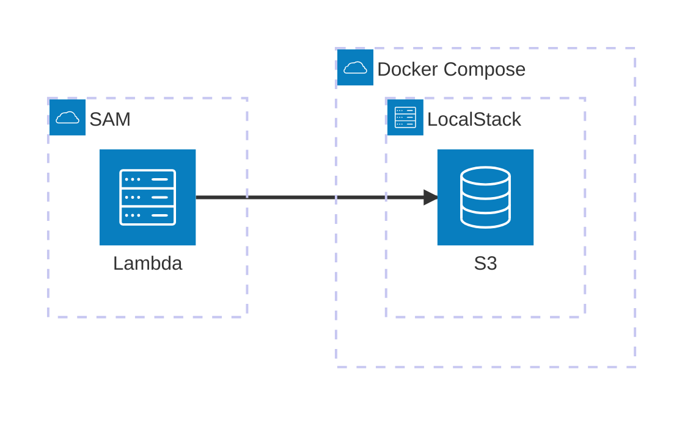

# CDK で構築した Lambda 関数をローカルで E2E テストするやつ

## architecture



## features

- [x] CDK で Lambda + API Gateway を構築する
- [x] SAMで API Gateway を立てる
- [ ] SAM で起動した Lambda から LocalStack の S3 にアクセスする

## requirements

- [go-task](https://taskfile.dev/)
    - v3.40.0
- Node.js
    - v20.18.0
- Docker
    - v27.3.1
- [AWS Serverless Application Model CLI(SAM CLI)](https://docs.aws.amazon.com/ja_jp/serverless-application-model/latest/developerguide/install-sam-cli.html)
    - v1.127.0

## run

```
docker compose up -d --wait
task start-api
```
